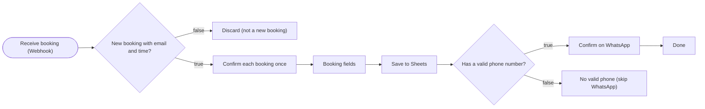

# Calendly booking to Google Sheets and WhatsApp confirmation

Graph of `templates/calendly-booking-to-sheets-and-whatsapp.json`, written by `scripts/docs.ts`. Do not edit it by hand.

```mermaid
flowchart LR
  n0(["Receive booking (Webhook)"])
  n1["Booking fields"]
  n2["Save to Sheets"]
  n3{"Has a valid phone number?"}
  n4["Confirm on WhatsApp"]
  n5["Done"]
  n6["No valid phone (skip WhatsApp)"]
  n7{"New booking with email and time?"}
  n8["Discard (not a new booking)"]
  n9["Confirm each booking once"]
  n0 --> n7
  n1 --> n2
  n2 --> n3
  n3 -- true --> n4
  n3 -- false --> n6
  n4 --> n5
  n7 -- true --> n9
  n7 -- false --> n8
  n9 --> n1
```
