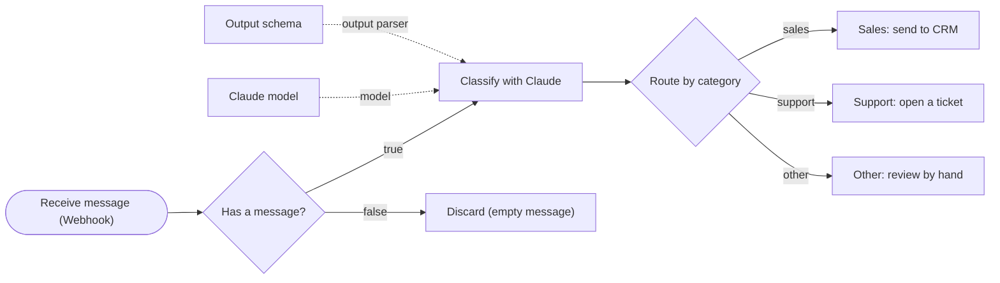

# Classify incoming messages with Claude and route them

Graph of `templates/classify-messages-with-claude.json`, written by `scripts/docs.ts`. Do not edit it by hand.

```mermaid
flowchart LR
  n0(["Receive message (Webhook)"])
  n1{"Has a message?"}
  n2["Classify with Claude"]
  n3["Claude model"]
  n4["Output schema"]
  n5{"Route by category"}
  n6["Sales: send to CRM"]
  n7["Support: open a ticket"]
  n8["Other: review by hand"]
  n9["Discard (empty message)"]
  n0 --> n1
  n1 -- true --> n2
  n1 -- false --> n9
  n2 --> n5
  n3 -. model .-> n2
  n4 -. output parser .-> n2
  n5 -- sales --> n6
  n5 -- support --> n7
  n5 -- other --> n8
```
