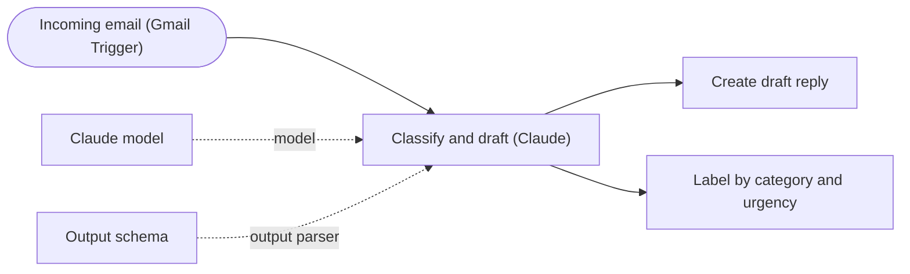

# Incoming email triage with Claude and a draft reply

Graph of `templates/email-triage-with-claude-draft-reply.json`, written by `scripts/docs.ts`. Do not edit it by hand.

```mermaid
flowchart LR
  n0(["Incoming email (Gmail Trigger)"])
  n1["Classify and draft (Claude)"]
  n2["Claude model"]
  n3["Output schema"]
  n4["Create draft reply"]
  n5["Label by category and urgency"]
  n0 --> n1
  n1 --> n4
  n1 --> n5
  n2 -. model .-> n1
  n3 -. output parser .-> n1
```
