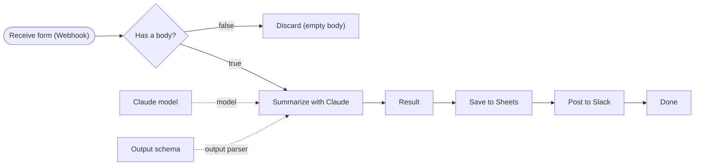

# Form response to Claude summary to Slack

Graph of `templates/form-to-claude-summary-to-slack.json`, written by `scripts/docs.ts`. Do not edit it by hand.

```mermaid
flowchart LR
  n0(["Receive form (Webhook)"])
  n1{"Has a body?"}
  n2["Discard (empty body)"]
  n3["Summarize with Claude"]
  n4["Claude model"]
  n5["Output schema"]
  n6["Result"]
  n7["Save to Sheets"]
  n8["Post to Slack"]
  n9["Done"]
  n0 --> n1
  n1 -- true --> n3
  n1 -- false --> n2
  n3 --> n6
  n4 -. model .-> n3
  n5 -. output parser .-> n3
  n6 --> n7
  n7 --> n8
  n8 --> n9
```
