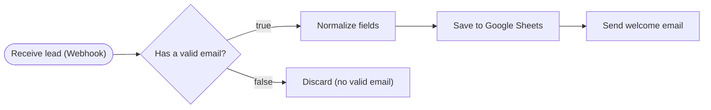

# Lead to Google Sheets and welcome email

Graph of `templates/lead-to-sheets-and-welcome-email.json`, written by `scripts/docs.ts`. Do not edit it by hand.

```mermaid
flowchart LR
  n0(["Receive lead (Webhook)"])
  n1{"Has a valid email?"}
  n2["Normalize fields"]
  n3["Save to Google Sheets"]
  n4["Send welcome email"]
  n5["Discard (no valid email)"]
  n0 --> n1
  n1 -- true --> n2
  n1 -- false --> n5
  n2 --> n3
  n3 --> n4
```
