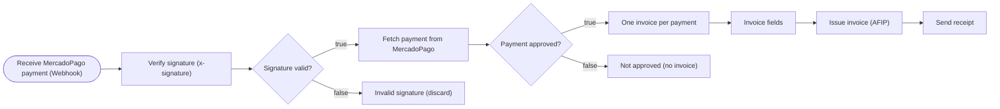

# MercadoPago payment to AFIP invoice

Graph of `templates/mercadopago-payment-to-afip-invoice.json`, written by `scripts/docs.ts`. Do not edit it by hand.

```mermaid
flowchart LR
  n0(["Receive MercadoPago payment (Webhook)"])
  n1["Verify signature (x-signature)"]
  n2{"Signature valid?"}
  n3["Fetch payment from MercadoPago"]
  n4{"Payment approved?"}
  n5["One invoice per payment"]
  n6["Invoice fields"]
  n7["Issue invoice (AFIP)"]
  n8["Send receipt"]
  n9["Invalid signature (discard)"]
  n10["Not approved (no invoice)"]
  n0 --> n1
  n1 --> n2
  n2 -- true --> n3
  n2 -- false --> n9
  n3 --> n4
  n4 -- true --> n5
  n4 -- false --> n10
  n5 --> n6
  n6 --> n7
  n7 --> n8
```
