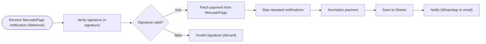

# MercadoPago payment to Google Sheets

Graph of `templates/mercadopago-payment-to-sheets.json`, written by `scripts/docs.ts`. Do not edit it by hand.

```mermaid
flowchart LR
  n0(["Receive MercadoPago notification (Webhook)"])
  n1["Verify signature (x-signature)"]
  n2{"Signature valid?"}
  n3["Fetch payment from MercadoPago"]
  n4["Skip repeated notifications"]
  n5["Normalize payment"]
  n6["Save to Sheets"]
  n7["Notify (WhatsApp or email)"]
  n8["Invalid signature (discard)"]
  n0 --> n1
  n1 --> n2
  n2 -- true --> n3
  n2 -- false --> n8
  n3 --> n4
  n4 --> n5
  n5 --> n6
  n6 --> n7
```
