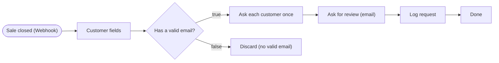

# Sale closed to Google review request

Graph of `templates/sale-closed-to-google-review-request.json`, written by `scripts/docs.ts`. Do not edit it by hand.

```mermaid
flowchart LR
  n0(["Sale closed (Webhook)"])
  n1["Customer fields"]
  n2{"Has a valid email?"}
  n3["Ask each customer once"]
  n4["Ask for review (email)"]
  n5["Log request"]
  n6["Done"]
  n7["Discard (no valid email)"]
  n0 --> n1
  n1 --> n2
  n2 -- true --> n3
  n2 -- false --> n7
  n3 --> n4
  n4 --> n5
  n5 --> n6
```
