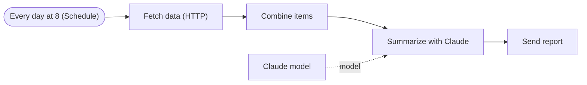

# Scheduled report written by Claude

Graph of `templates/scheduled-report-with-claude.json`, written by `scripts/docs.ts`. Do not edit it by hand.

```mermaid
flowchart LR
  n0(["Every day at 8 (Schedule)"])
  n1["Fetch data (HTTP)"]
  n2["Combine items"]
  n3["Summarize with Claude"]
  n4["Claude model"]
  n5["Send report"]
  n0 --> n1
  n1 --> n2
  n2 --> n3
  n3 --> n5
  n4 -. model .-> n3
```
