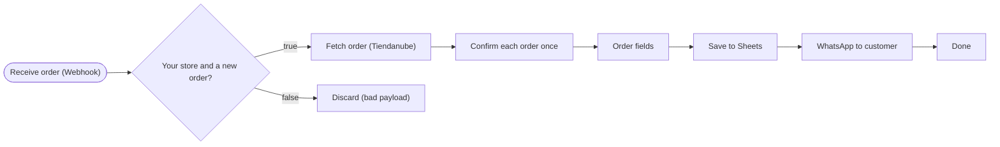

# Tiendanube order to Google Sheets and WhatsApp

Graph of `templates/tiendanube-order-to-sheets-and-whatsapp.json`, written by `scripts/docs.ts`. Do not edit it by hand.

```mermaid
flowchart LR
  n0(["Receive order (Webhook)"])
  n1{"Your store and a new order?"}
  n2["Fetch order (Tiendanube)"]
  n3["Order fields"]
  n4["Save to Sheets"]
  n5["WhatsApp to customer"]
  n6["Done"]
  n7["Discard (bad payload)"]
  n8["Confirm each order once"]
  n0 --> n1
  n1 -- true --> n2
  n1 -- false --> n7
  n2 --> n8
  n3 --> n4
  n4 --> n5
  n5 --> n6
  n8 --> n3
```
