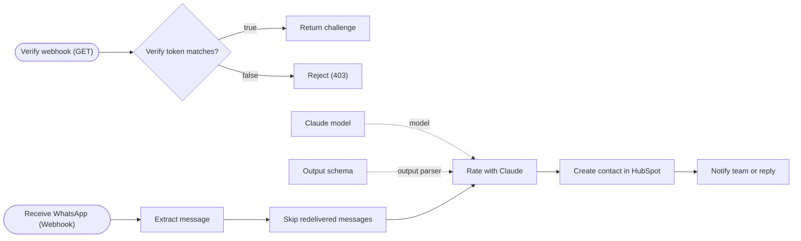

# WhatsApp message to Claude lead rating to HubSpot

Graph of `templates/whatsapp-to-claude-lead-rating-to-hubspot.json`, written by `scripts/docs.ts`. Do not edit it by hand.

```mermaid
flowchart LR
  n0(["Verify webhook (GET)"])
  n1{"Verify token matches?"}
  n2["Return challenge"]
  n3["Reject (403)"]
  n4(["Receive WhatsApp (Webhook)"])
  n5["Extract message"]
  n6["Rate with Claude"]
  n7["Claude model"]
  n8["Output schema"]
  n9["Create contact in HubSpot"]
  n10["Notify team or reply"]
  n11["Skip redelivered messages"]
  n0 --> n1
  n1 -- true --> n2
  n1 -- false --> n3
  n4 --> n5
  n5 --> n11
  n6 --> n9
  n7 -. model .-> n6
  n8 -. output parser .-> n6
  n9 --> n10
  n11 --> n6
```
